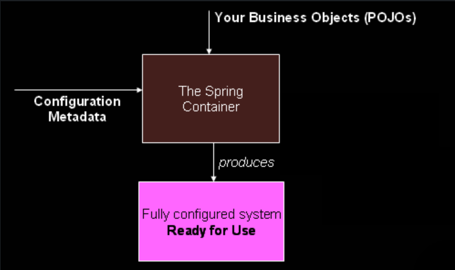

# Spring Framework

## 一. 核心技术

### 1.IoC容器

#### 1.简介

**IoC（Inversion of Control）又叫DI（Dependency Injection）**。它指的是这样一种过程：对象仅通过构造方法参数，工厂方法参数，或者对象实例（构造方法执行后或者工厂方法返回）要赋值的属性（properties that are set on the object instance）来定义它的依赖。原本bean通过构造方法或者其他的机制（如Service Locator pattern）直接控制实例化和依赖位置，引入spring容器之后，这个控制权交给了容器，这就是控制反转，也即IoC。

`org.springframework.beans`和`org.springframework.context`两个包构成了IoC容器的基础。[BeanFactory](https://docs.spring.io/spring-framework/docs/6.0.9/javadoc-api/org/springframework/beans/factory/BeanFactory.html)接口提供了一种高级的配置机制用于管理各种类型对象。[ApplicationContext](https://docs.spring.io/spring-framework/docs/6.0.9/javadoc-api/org/springframework/context/ApplicationContext.html)是BeanFactory的子接口。它多了以下特性：

- 与Spring AOP更容易整合
- 国际化
- 事件发布
- application-layer特定的上下文，比如在web应用中使用的WebApplicationContext

简言之，ApplicaitonContext是BeanFactory的超集，提供了更多面向企业的功能。Spring Framework介绍IoC容器时主要篇幅也是放在ApplicationContext上。

##### bean的由来

Spring把构成application基础以及由IoC容器管理的对象叫做bean。换句话说，bean指的就是那些由IoC容器实例化，组装，以及管理的对象。这些bean可以在容器的配置元数据(configuration metadata)里看到。

#### 2.容器概述

`org.springframework.context.ApplicationContext`代表**Spring IoC容器**，负责实例化，配置，组装bean。它通过读取配置元数据知道实例化，配置，组装哪些bean。元数据以**XML**，**注解**以及**Java代码**的方式呈现。

传统的用XML初始化容器的代码片段如下：

```xml
<context-param>
	<param-name>contextConfigLocation</param-name>
	<param-value>/WEB-INF/daoContext.xml /WEB-INF/applicationContext.xml</param-value>
</context-param>

<listener>
	<listener-class>org.springframework.web.context.ContextLoaderListener</listener-class>
</listener>
```

即通过`ContextLoaderListener`读取/WEB-INF下以Context.xml结尾的文件（可以指定读取哪些xml）

**IoC容器抽象**



##### 配置元数据

配置方式：

- XML
- [Annotation-based configuration](https://docs.spring.io/spring-framework/reference/core/beans/annotation-config.html)
- [Java-based configuration](https://docs.spring.io/spring-framework/reference/core/beans/java.html)

XML通过<beans/>标签内的<bean/>标签定义bean信息。注解方式通过标注了@Configuration的类里面的@Bean注解定义bean。

##### 实例化容器

比较常见的加载配置元数据方式有两种，一种位于本地文件系统，一种在Java `CLASSPATH`

1.常见的加载方式

```java
// 下面这行代码做了两件事
ApplicationContext context = new ClassPathXmlApplicationContext("services.xml", "daos.xml");

// 第一件事： 找到当前applicationContext的父 environment。如果有，将父 environment的profiles,property sources与当前applicationContext合并
public void setParent(@Nullable ApplicationContext parent) {
    this.parent = parent;
    if (parent != null) {
        Environment parentEnvironment = parent.getEnvironment();
        if (parentEnvironment instanceof ConfigurableEnvironment configurableEnvironment) {
            getEnvironment().merge(configurableEnvironment);
        }
    }
}

// 第二件事：刷新容器，加载所有bean
if (refresh) {
    refresh();
}
```

```java
ApplicationContext ctx = new FileSystemXmlApplicationContext("conf/appContext.xml");
```

2.更灵活的加载方式

```java
GenericApplicationContext context = new GenericApplicationContext();
new XmlBeanDefinitionReader(context).loadBeanDefinitions("services.xml", "daos.xml");
context.refresh();
```

##### 使用容器

通过`getBean`方法，可以从容器中获取bean实例。文档建议：业务代码里其实不该有显式的调用getBean，更常见可能是通过autowiring相关注解获取相关实例。

```java
// create and configure beans
ApplicationContext context = new ClassPathXmlApplicationContext("services.xml", "daos.xml");

// retrieve configured instance
PetStoreService service = context.getBean("petStore", PetStoreService.class);

// use configured instance
List<String> userList = service.getUsernameList();
```

#### 3.Bean概述

定义bean的信息由`BeanDefinition`对象表示，BeanDefinition包含下列信息：

- 实现类的全类名
- Bean行为信息。如作用域，生命周期（回调）等
- 其他Bean的引用。这些引用也叫做依赖或者collaborators(协作者)
- 其他配置信息。如连接池的连接数，大小等

`ApplicationContext`实现类也允许手动注册不在容器里的对象。通过获取ApplicaitonContext的`BeanFactory`（getBeanFactory()），调用`registerSingleton()`或`registerBeanDefinition()`方法完成注册。

---

手动注册要尽可能早，以便容器正确的装配。尽管Spring容器支持覆盖已存在的元数据和单例实例，但运行时创建对象官方并不建议，因为可能导致并发获取异常，IoC容器里状态不一致等问题。

---

##### Bean命名

每个bean都有唯一标识符，标识符可以有多个，多余的会被视作别名。XML配置方式中，`id`和`name`都可以做标识符，不过`id`必须在IoC容器里唯一。命名规则建议按Java驼峰命名，风格统一，也方便AOP根据名字切入。

组件扫描时对未命名的component会使用全路径+驼峰类名。

`@Bean`加载方法上，会使用方法名作为标识符，`@Bean`支持修改自己命名

```java
@Bean({"dataSource", "subsystemA-dataSource", "subsystemB-dataSource"})
public DataSource dataSource() {
    // instantiate, configure and return DataSource bean...
}
```

##### 实例化Bean

在XML配置中，我们会给bean指定`class`属性，对应`BeanDefinition`中`beanClass`字段

- 大多数情况下，IoC容器通过反射调用class对应的构造方法；
- 如果通过静态工厂方法生成bean，此时`class`或`beanClass`指向工厂方法所在类；

```xml
<bean id="clientService"
      class="examples.ClientService"
      factory-method="createInstance"/>
```

- 如果通过实例工厂方法生成bean，此时`class`不写，需指明工厂方法及工厂方法实例；

```xml
<!-- the factory bean, which contains a method called createInstance() -->
<bean id="serviceLocator" class="examples.DefaultServiceLocator">
    <!-- inject any dependencies required by this locator bean -->
</bean>

<!-- the bean to be created via the factory bean -->
<bean id="clientService"
      factory-bean="serviceLocator"
      factory-method="createClientServiceInstance"/>


<!-- 包含多个实例工厂方法的实例配置 -->
<bean id="serviceLocator" class="examples.DefaultServiceLocator">
	<!-- inject any dependencies required by this locator bean -->
</bean>

<bean id="clientService"
	factory-bean="serviceLocator"
	factory-method="createClientServiceInstance"/>

<bean id="accountService"
	factory-bean="serviceLocator"
	factory-method="createAccountServiceInstance"/>
```

---

对于内部类，可以使用`$`或`.`表示：`com.example.SomeThing$OtherThing` or `com.example.SomeThing.OtherThing`。

---

##### 确定Bean的运行时类型

确定Bean的运行时类型并不容易。一方面，有些是工厂方法产生的Bean或者有些Bean本身就是FactoryBean的实现子类；另一方面，基于接口的AOP代理仅暴露少量的信息，所以想确定Bean的运行时class不简单。

推荐的方法是通过`BeanFactory`的`getType(String name)`方法获取Bean的运行时类型。与之类似，`BeanFactory`还有`getBean(String name)`可以获取容器中的Bean实例。

#### 4. 依赖概述

##### 4.1 依赖注入（DI）

**依赖**指的是生成当前Bean实例所需要的其他字段或Bean实例。**依赖注入**指的是这样一个过程：创建当前Bean的时候，可能构造方法或工厂方法会传参，以及生成Bean实例之后会对某些属性赋值，那么在创建当前Bean时，需要将这些依赖一并注入到容器。

依赖注入的本质就是控制反转（IoC）。

这样做的好处是解耦。Bean实例不用知道自己的依赖是哪些，在哪，是什么类。因此，更容易unit test。


依赖注入主要分为两种：

1. 构造器注入
2. Setter注入

###### 构造器注入

将依赖通过构造方法的参数或工厂方法的参数注入从而生成Bean实例

构造器参数解析按照参数类型，解析顺序按照参数定义的顺序。可以使用`@ConstructorProperties`指定参数名

```java
public class ExampleBean {

    // Fields omitted

    @ConstructorProperties({"years", "ultimateAnswer"})
    public ExampleBean(int years, String ultimateAnswer) {
        this.years = years;
        this.ultimateAnswer = ultimateAnswer;
    }
}
```

###### Setter注入

将依赖通过set方法在容器调用无参构造方法或工厂方法后注入

```java
public class SimpleMovieLister {

    // the SimpleMovieLister has a dependency on the MovieFinder
    private MovieFinder movieFinder;

    // a setter method so that the Spring container can inject a MovieFinder
    public void setMovieFinder(MovieFinder movieFinder) {
        this.movieFinder = movieFinder;
    }

    // business logic that actually uses the injected MovieFinder is omitted...
}
```

`ApplicationContext`既支持Setter注入，也支持构造器注入，还可以两种方式混合。

官方推荐必需的依赖使用构造器注入（确保容器中的对象不可变及依赖不为空，返回的对象是一个完全初始化好的状态），可选的依赖用Setter注入（可以设置默认值，必须做非空校验，可以结合 [JMX MBeans](https://docs.spring.io/spring-framework/reference/integration/jmx.html)）。同时，在Setter上加`@Autowired`会使得这个属性变成必须属性；

---

依赖注入需要依靠BeanDefinition提供配置元数据（configuration metadata）信息，那BeanDefinition怎么来的呢？在BeanDefinition之前，Spring内部自动扫描xml配置文件（Bean定义信息），注解（如`@Component`, `@Controller`等），将扫描到的这些Bean的定义信息利用`PropertyEditor`（JDK自带， Spring在`org.springframework.beans.propertyeditors`包拓展了各种Editors），转换格式，最终变成`BeanDefnition`从而加载整个IoC容器

---

###### 依赖解析过程

解析过程：

- `ApplicationContext`创建，并根据配置元数据（XML，Java代码，注解）完成初始化。
- 对于每个Bean，它的依赖可能包含属性字段，构造方法参数，工厂方法参数。当Bean创建时，容器会提供这些依赖。
- 每个属性字段，构造方法参数可能是定义好的要设置的值，也可能是对容器中另一个Bean的引用（reference）。
- 每个属性字段，构造方法参数的值可以从原本提供的格式转换成实际类型的参数值。Spring默认可以将以字符串格式提供的值转换成Java所有内置数据类型的的值，如`int`，`long`，`String`，`boolean`等。

IoC容器在创建是就会校验每个Bean的配置。但是赋值是在创建该Bean时发生的

###### 循环依赖

---

场景：类A构造器注入需要类B，类B构造器注入需要类A。IoC容器会抛`BeanCurrentlyInCreationException`异常。

官方提供的一个解决方案是将其中的一些类改成set方法注入

---
